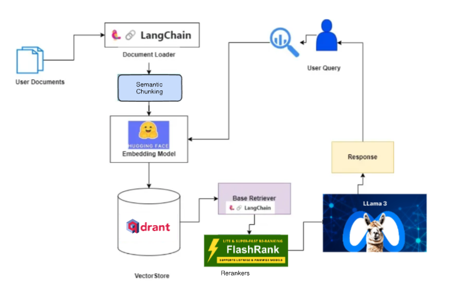
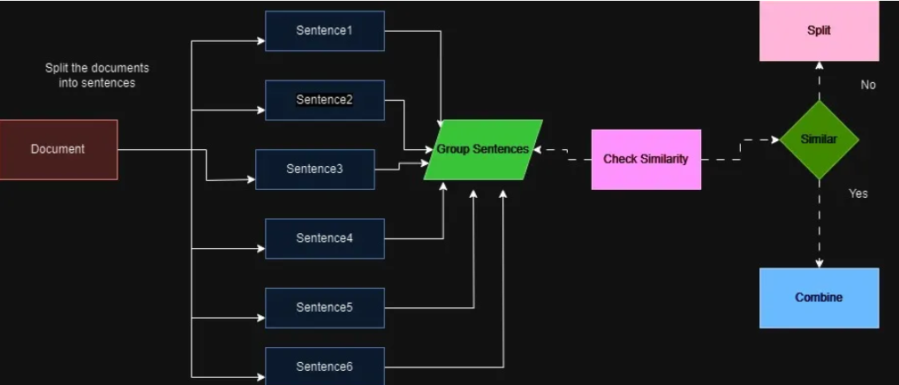

# Agent Workflow: A Technical Deep Dive

---

---

## 1. User Documents

The workflow commences with the user's documents, which form the foundational knowledge base for the chatbot system. These documents can encompass a wide range of formats, such as PDFs, Word files, or plain text files, containing information pertinent to the domain in which the chatbot operates. To accommodate this diversity of document formats, a robust and versatile document loading mechanism is essential.

## 2. LangChain - Document Loader

LangChain, an open-source framework designed to facilitate the development of applications involving large language models (LLMs) and other natural language processing (NLP) components, plays a pivotal role in this workflow through its Document Loader module. This module acts as a bridge between the raw document formats and the downstream components of the chatbot system.

The Document Loader is responsible for ingesting and processing the user's documents, handling the parsing and conversion of various document types. It ensures that the textual content is extracted and structured in a standardized format, enabling seamless data flow and efficient handling of diverse document sources. This step is crucial for ensuring compatibility with subsequent stages of the workflow, enabling smooth integration and data processing.

## 3. Semantic Chunking

Once the documents have been loaded and their content extracted, the next step is semantic chunking. This process involves dividing the text into smaller, meaningful chunks or segments based on their semantic context and relationships. 

Semantic chunking is essential for several reasons:

1. **Efficiency Enhancement**: By breaking down large blocks of text into more manageable units, the embedding model's efficiency is improved, enabling faster and more efficient processing.

2. **Contextual Preservation**: Semantic chunking preserves the contextual relationships within the text, ensuring that related concepts and ideas are grouped together, facilitating more accurate and relevant responses.

3. **Focused Retrieval**: By allowing the chatbot to focus on specific chunks of information relevant to the user's query, semantic chunking enhances the precision and relevance of the retrieved information.

## 4. Embedding Model

At the core of the chatbot system lies an embedding model, which plays a crucial role in transforming textual data into numerical representations known as embeddings. These embeddings capture the semantic and contextual relationships between words, phrases, and concepts, enabling efficient processing and retrieval of relevant information.

The image depicts a "LLAMA 3" embedding model, likely referring to a specific variant of the LLaMA (Large Language Model Adapter) architecture developed by Meta AI. LLaMA is a powerful and efficient language model that has demonstrated remarkable performance in various natural language processing tasks, including text generation, translation, and question answering.

The embedding model's primary function is to convert the semantically chunked text segments into high-dimensional vector representations. These embeddings encode the underlying meaning and context of the text, enabling the system to perform computations and comparisons in the vector space, facilitating tasks such as similarity measurement, clustering, and information retrieval.

## 5. Vector Store (drant)

The generated embeddings are stored in a vector store, which serves as a scalable and efficient data structure for indexing and querying these high-dimensional vectors. The image depicts the use of "drant," which is likely an abbreviation for "Durable Random Accessible Node Tree," a variant of the Hierarchical Navigable Small World (HNSW) graph-based data structure.

Drant is an open-source project designed for efficient storage and retrieval of dense vectors, making it well-suited for the vector embeddings generated by the embedding model. Its underlying data structure allows for fast nearest neighbor searches, enabling the chatbot system to quickly retrieve the most relevant information based on the user's query.

By storing the embeddings in a vector store like drant, the chatbot system gains the ability to perform similarity searches, matching the user's query against the indexed embeddings to identify the most relevant textual segments from the knowledge base.

## 6. Base Retriever & LangChain

The Base Retriever component, together with LangChain, facilitates the retrieval of relevant information from the vector store based on the user's query. LangChain provides a high-level interface for interacting with the vector store, enabling efficient querying and retrieval of the most relevant embeddings and their associated textual content.

The Base Retriever acts as an intermediary between the user's query and the vector store, translating the query into a suitable format for the vector store's search algorithms. It leverages the capabilities of LangChain to perform vector similarity searches, retrieving the most relevant embeddings and their corresponding textual chunks from the knowledge base.

## 7. Rerankers

While the initial retrieval process identifies relevant textual chunks based on their embeddings' similarity to the user's query, there may be instances where additional refinement is required. This is where rerankers come into play, providing an extra layer of optimization to improve the relevance and accuracy of the retrieved information.

The image depicts the use of "FlashRank," which is likely a reference to a specific reranking algorithm or technique. Rerankers can employ various strategies, such as language models, scoring functions, or rule-based systems, to evaluate the retrieved textual chunks and reorder them based on additional criteria or context.

By incorporating rerankers, the chatbot system can further enhance the relevance of the retrieved information, ensuring that the most pertinent and accurate textual chunks are prioritized for generating the final response.

## 8. User Query

The user query is the starting point of the chatbot interaction. It represents the question, statement, or input provided by the user, which the chatbot system aims to comprehend and respond to effectively.

The user query serves as the basis for the entire workflow, guiding the retrieval of relevant information from the knowledge base and influencing the generation of an appropriate response.

## 9. Semantic Chunking (User Query)

Similar to the processing of the knowledge base documents, the user query may also undergo semantic chunking. This step helps break down the query into smaller, meaningful units, enabling more accurate understanding and processing of the user's intent and context.

By chunking the query semantically, the chatbot system can better identify and extract the key concepts, entities, and relationships present in the query, facilitating more precise information retrieval and response generation.

## 10. Response Generation

The final stage of the chatbot workflow is response generation, where the retrieved and reranked textual chunks are combined and synthesized to formulate a coherent and relevant response to the user's query.

This process may involve techniques such as language generation models, template-based systems, or rule-based approaches tailored to the specific domain and use case. The generated response aims to provide the user with accurate and contextual information while maintaining a natural and conversational flow.

The response generation stage leverages the collective output of the preceding components, including the retrieved and reranked textual chunks, as well as any additional context or metadata associated with the user's query or the knowledge base documents.

## Future Deployment and Scaling Approaches

As the number of lectures, papers, or other educational resources grows, the chatbot system must be designed to scale efficiently and maintain its performance. Here are some potential deployment and scaling approaches:

1. **Distributed Vector Store**: To handle a large volume of embeddings and ensure efficient retrieval, the vector store (drant) can be distributed across multiple nodes or servers. This distributed architecture allows for parallel processing, load balancing, and horizontal scaling, enabling the system to handle an increasing number of embeddings without compromising performance.

2. **Sharding and Partitioning**: The knowledge base can be partitioned or sharded based on specific criteria, such as subject matter, domains, or topics. Each shard or partition can have its own dedicated vector store, embedding model, and associated components. This approach not only enhances scalability but also enables specialized processing and optimization for different knowledge domains.

3. **Incremental Indexing and Updates**: Instead of reindexing the entire knowledge base every time new content is added, an incremental indexing and updating mechanism can be implemented. This approach allows for efficient integration of new documents or resources into the existing vector store and knowledge base, minimizing downtime and ensuring seamless operation.

4. **Caching and Precomputation**: Frequently accessed or computationally intensive operations, such as embedding generation or similarity searches, can be cached or precomputed to reduce latency and improve overall system performance. This approach can be particularly beneficial for handling frequently asked queries or retrieving information from commonly accessed knowledge domains.

5. **Containerization and Orchestration**: Deploying the chatbot system using containerization technologies like Docker and orchestration platforms like Kubernetes can facilitate scalability, portability, and efficient resource management. Containerization allows for easy scaling by adding or removing container instances based on demand, while orchestration platforms automate deployment, scaling, and management processes.

6. **Cloud-based Deployment**: Leveraging cloud computing platforms, such as Amazon Web Services (AWS), Google Cloud Platform (GCP), or Microsoft Azure, can provide scalable and elastic resources